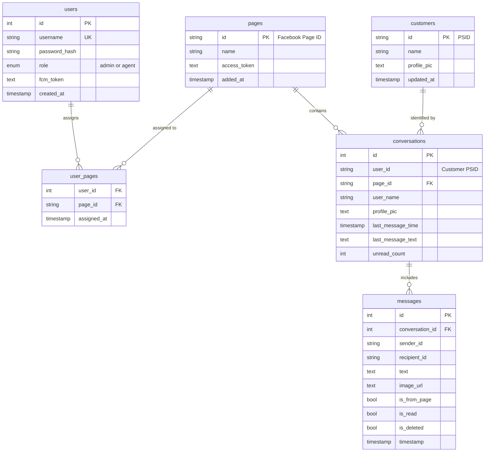

# Current State Analysis: Facebook Messenger Management Dashboard

## 📋 Executive Summary

Your application is a **production-ready Facebook Messenger management dashboard** that enables businesses to manage customer conversations from Facebook Pages. It currently operates as a **single-tenant application** with multi-agent support.

**Verdict: YES, this can absolutely be made into a SaaS product with moderate effort.**

---

## 🏗️ Current Architecture

### Technology Stack

#### Backend
- **Framework**: Express.js v5 (Node.js)
- **Database**: MySQL 8.0+ with connection pooling
- **Real-time**: Socket.IO v4 for WebSocket communication
- **Authentication**: Session-based with MySQL session store
- **Security**: Helmet, CORS, bcrypt password hashing
- **Process Manager**: PM2 for production deployment
- **File Uploads**: Multer for image/media handling
- **Notifications**: Firebase Admin SDK for push notifications

#### Frontend  
- **Framework**: React v19 with Vite build tool
- **State Management**: Redux Toolkit with RTK Query
- **Routing**: React Router v7
- **Styling**: TailwindCSS v3
- **Real-time Client**: Socket.IO Client v4
- **UI Components**: Lucide React icons

#### Infrastructure
- **Web Server**: Nginx (reverse proxy, SSL termination)
- **SSL**: Let's Encrypt via Certbot
- **Deployment**: PM2 + Nginx on Oracle Cloud/VPS
- **Domain**: Currently deployed at graceportpro.com

### Database Schema

The application uses a well-designed relational schema:

**Key Features:**
- ✅ Indexed for performance (composite indexes on frequently queried columns)
- ✅ Denormalized fields for optimization (`last_message_text`, `unread_count`)
- ✅ Database triggers for automatic metadata updates
- ✅ Archive table for long-term message storage
- ✅ UTF-8mb4 charset for emoji support
- ✅ Foreign key constraints with cascading deletes

---

## 🎯 Current Features

### Core Functionality
- ✅ **Facebook Messenger Integration**: Webhook-based message receiving/sending
- ✅ **Real-time Messaging**: Instant message updates via Socket.IO
- ✅ **Multi-Agent Support**: Multiple agents can handle conversations
- ✅ **Admin Dashboard**: User management, page assignment
- ✅ **Master Inbox**: View all conversations across all assigned pages
- ✅ **Push Notifications**: Firebase Cloud Messaging integration
- ✅ **Customer Notes**: Persistent notes for customer interactions
- ✅ **Media Upload**: Image/file sending to Facebook
- ✅ **Database Viewer**: Admin tool for direct database access
- ✅ **Conversation Management**: Name updates, message history
- ✅ **Unread Count Tracking**: Automatic tracking of unread messages
- ✅ **Message Archival**: Scheduled archiving of old messages

### User Roles
1. **Admin**: Full system access, user management, page management
2. **Agent**: Access to assigned pages and conversations

### Authentication & Security
- Session-based authentication with secure cookies
- Password hashing with bcrypt
- CORS protection with configurable origins
- Helmet.js security headers
- HTTPS enforcement in production
- Role-based access control (RBAC)

---

## 📊 Current Limitations (Single-Tenant Issues)

### 🔴 Critical Limitations

1. **Single Organization Model**
   - All users share the same Facebook pages
   - No concept of separate "companies" or "workspaces"
   - All admins can manage all pages

2. **Shared Database**
   - Single database for all users
   - No tenant isolation
   - Security risk if one customer's data is compromised

3. **No Billing System**
   - No subscription management
   - No payment processing
   - No usage tracking or limits

4. **Manual Onboarding**
   - Admin must manually create users
   - No self-service registration
   - No automated provisioning

5. **Configuration Hardcoded**
   - Single session secret for all users
   - Shared CORS origins
   - No per-tenant customization

### 🟡 Moderate Limitations

6. **No Usage Limits**
   - Unlimited conversations
   - Unlimited agents
   - Unlimited message storage

7. **No Analytics Dashboard**
   - No business metrics per tenant
   - No reporting features
   - No usage statistics

8. **Single Domain**
   - All users access via same domain
   - No white-labeling support
   - No custom branding per tenant

9. **Manual Page Integration**
   - Admin must add Facebook pages manually
   - No OAuth flow for Facebook integration
   - Page tokens stored in database (security concern)

### 🟢 Minor Limitations

10. **No API for Third Parties**
    - No REST API documentation
    - No webhook system for integrations
    - No SDK for developers

11. **Limited Notification System**
    - FCM tokens stored per user, not per device
    - No notification preferences
    - No email notifications

---

## 🔐 Current Security Posture

### ✅ Good Practices
- Password hashing with bcrypt
- Session-based authentication
- HTTPS enforcement
- SQL injection protection (parameterized queries)
- CORS configuration
- Security headers via Helmet

### ⚠️ Security Concerns for SaaS
- **Shared session secret**: All tenants use same session key
- **Shared database**: No logical separation between tenants
- **Access token storage**: Facebook tokens in plain text in database
- **No audit logging**: No tracking of who did what
- **No rate limiting**: Vulnerable to abuse
- **No IP whitelisting**: No network-level access controls
- **No 2FA/MFA**: Only username/password authentication

---

## 📈 Current Performance & Scalability

### ✅ Strengths
- Database indexes for fast queries
- Connection pooling
- Denormalized data for read optimization
- Message archival system
- Efficient Socket.IO implementation

### ⚠️ Scalability Concerns
- **Vertical Scaling Only**: Single MySQL instance
- **No Caching Layer**: Every request hits database
- **No CDN**: Static assets served from origin
- **No Load Balancing**: Single Node.js process via PM2
- **No Horizontal Scaling**: Socket.IO not configured for multi-server
- **No Queue System**: Webhook processing is synchronous

---

## 💰 Current Deployment Cost (Estimated)

For a **single organization** deployment:

| Resource | Cost/Month | Notes |
|----------|------------|-------|
| Oracle Cloud VPS (4GB RAM) | $0-50 | Free tier available |
| MySQL Database | $0 | Self-hosted on VPS |
| Domain Name | $10-15 | graceportpro.com |
| SSL Certificate | $0 | Let's Encrypt free |
| Firebase (Push Notifications) | $0-25 | Free tier: 10M messages/month |
| **Total** | **$10-90/month** | For single tenant |

---

## 🎯 Current Value Proposition

Your application is currently positioned as:

> **"A self-hosted Facebook Messenger management tool for small to medium businesses with multiple agents handling customer conversations."**

**Ideal for:**
- Small businesses with 1-10 agents
- E-commerce stores using Facebook Messenger
- Customer support teams needing centralized inbox
- Businesses wanting full data control (self-hosted)

**Not suitable for:**
- Enterprise with hundreds of agents
- Multi-location franchises needing tenant isolation
- Agencies managing multiple client businesses
- SaaS businesses needing scalable infrastructure

---

## 🔄 Mobile Application

Based on conversation history, you have a **Flutter mobile app** that:
- Connects to the same backend API
- Supports wireless debugging
- Has authentication issues previously debugged
- Acts as a mobile client for the dashboard

**Mobile App Readiness for SaaS:**
- ✅ Can support multi-tenant with backend changes
- ⚠️ Needs tenant selection UI
- ⚠️ Needs white-labeling support for branding
- ⚠️ Currently hardcoded to single backend URL

---

## 📝 Code Quality Assessment

### ✅ Strengths
- Well-organized MVC architecture
- Consistent coding patterns
- Comprehensive README
- Database migrations system
- Environment variable configuration
- Error handling middleware
- Clear separation of concerns

### ⚠️ Areas for Improvement
- Limited test coverage (no automated tests)
- No API documentation (Swagger/OpenAPI)
- Minimal code comments
- No TypeScript (JavaScript only)
- Hard-coded business logic in routes
- No input validation library (e.g., Joi, Zod)

---

## 🎯 Summary: Is This SaaS-Ready?

### Current State: **60% Ready**

| Aspect | Readiness | Comments |
|--------|-----------|----------|
| **Core Features** | 90% | Solid feature set, needs minor additions |
| **Architecture** | 40% | Needs multi-tenancy refactoring |
| **Security** | 50% | Good foundation, needs tenant isolation |
| **Scalability** | 30% | Designed for single org, needs rework |
| **Billing** | 0% | No payment system exists |
| **Documentation** | 60% | Good README, needs API docs |
| **DevOps** | 40% | Manual deployment, needs automation |
| **Mobile Support** | 70% | Flutter app exists, needs multi-tenant |

### Transformation Effort: **Medium (3-6 months)**

**Estimated Development Time:**
- Multi-tenancy refactoring: 6-8 weeks
- Billing integration: 3-4 weeks
- Self-service onboarding: 2-3 weeks
- Enhanced security: 2-3 weeks
- Scalability improvements: 4-6 weeks
- Testing & QA: 3-4 weeks
- Documentation: 2 weeks

**Total: 22-30 weeks (5.5-7.5 months) for MVP SaaS**

---

## 🚀 Next Steps

See the companion document: **[saas_transformation_plan.md](file:///C:/Users/DELL/.gemini/antigravity/brain/7f624408-2382-432a-994c-52f60e33a5cc/saas_transformation_plan.md)** for:
- Detailed architecture redesign
- Multi-tenancy implementation strategies
- Billing and subscription models
- Step-by-step implementation roadmap
- Cost and pricing analysis
- Technology stack recommendations
